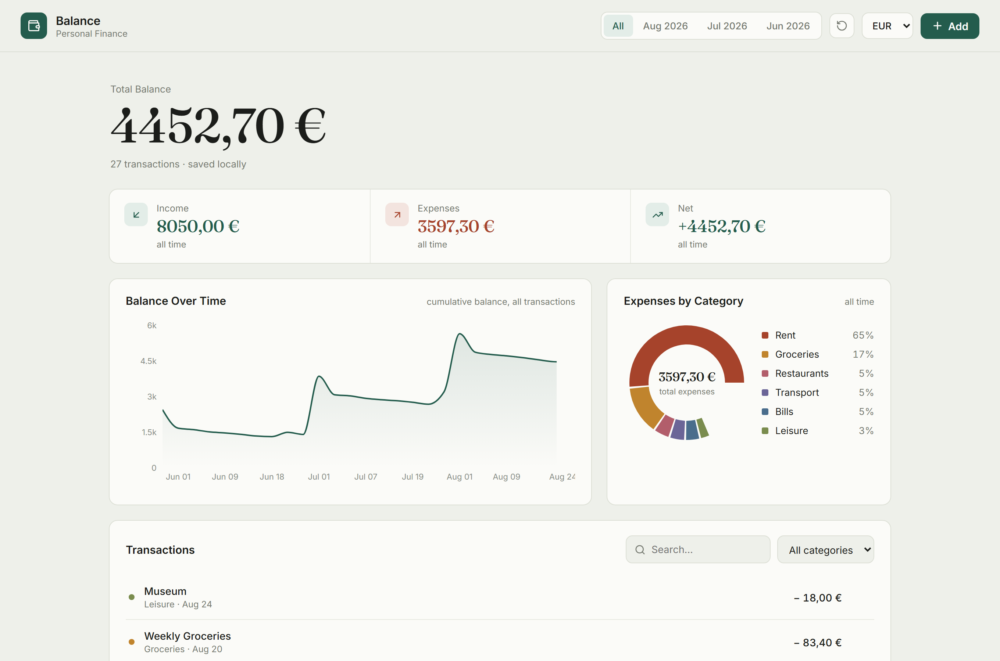

# Saldo — Personal Finance Dashboard

A React application for tracking income and expenses. Add or remove a
transaction and everything — balance, charts and category breakdown —
recomputes in real time.

The interface is localized in Italian; all code and documentation are in
English.

> **Live demo:** _(GitHub Pages URL appears here after the first deploy —
> see "Deploy" below)_


<!-- Replace with a real screenshot: run the app, capture the screen and
     save it as docs/screenshot.png -->

## Features

- Total balance with an animated count-up (serif display numerals)
- Balance-over-time area chart
- Expense breakdown by category (donut chart)
- Add transactions through a validated form
- Text search and filters by period and category
- Currency switcher (EUR / USD / GBP) via React context
- Responsive layout, visible keyboard focus, respects `prefers-reduced-motion`

## Stack

- **React 18** (hooks, context, function components)
- **Vite** — dev server and build
- **Recharts** — charts
- **lucide-react** — icons
- **Vitest** — unit tests

## Getting started

```bash
npm install     # install dependencies
npm run dev     # start the dev server at http://localhost:5173
npm test        # run the tests
npm run build   # production build in the dist/ folder
```

## Project structure

```
src/
├── App.jsx                 # composition + memoized derived state
├── main.jsx                # entry point
├── styles.css              # "Ledger" theme (pine + sienna on cool paper)
├── context/
│   └── Settings.jsx        # currency + money formatter (React context)
├── components/             # UI components, one per responsibility
│   ├── Topbar.jsx          #   period tabs, currency switcher, add button
│   ├── Hero.jsx
│   ├── StatCards.jsx
│   ├── BalanceChart.jsx
│   ├── CategoryDonut.jsx
│   ├── TransactionList.jsx
│   └── AddForm.jsx
├── hooks/
│   ├── useTransactions.js  # transactions state + operations
│   └── useCountUp.js        # number-animation hook
├── lib/
│   ├── selectors.js        # pure calculations (totals, series, breakdown)
│   └── format.js           # date + period formatting
├── data/
│   ├── categories.js       # domain categories + swatch colors
│   └── seed.js             # sample data
└── test/
    ├── selectors.test.js   # calculation tests
    └── render.test.jsx     # render smoke test
```

## Design decisions

- **Logic separated from the UI.** Calculations live in `lib/selectors.js` as
  pure functions: reusable, easy to read and covered by tests. Components only
  decide how data is displayed.
- **Memoized derived state.** Totals and chart series aren't duplicated in
  state — they're derived from the transactions with `useMemo`, so there's a
  single source of truth. `periodItems` is filtered once and feeds both the
  stats and the breakdown.
- **Currency in context.** The selected currency and its formatter live in a
  small React context, so any component can format money without prop drilling.
  Switching currency reformats the same amounts; it does not apply FX rates.
- **Hand-written styles.** No CSS framework — the palette, spacing and layout
  are defined in a single stylesheet.

## Complexity

With `n` transactions, each derived value is a single `O(n)` pass, except the
balance timeline, which sorts once (`O(n log n)`). Every derivation is memoized,
so it only recomputes when its inputs change; typing in the search box, for
example, doesn't retrigger the balance or timeline calculations.

At this data size the numbers are trivial — the point is keeping the passes
linear and the work memoized rather than micro-optimizing prematurely. For very
large lists the next steps would be debouncing the search input and virtualizing
the transaction list.

## Deploy (GitHub Pages)

The repo includes a workflow at `.github/workflows/deploy.yml` that builds and
publishes to GitHub Pages on every push to `main`.

1. Push the project to a GitHub repository.
2. In the repo, open **Settings → Pages** and set **Source** to
   **GitHub Actions**.
3. Push to `main` (or run the workflow manually). The site publishes at
   `https://<username>.github.io/<repo-name>/`.

`vite.config.js` uses `base: "./"`, so the build works under the repo
subpath without hardcoding the repository name.

## Possible extensions

Data persistence (localStorage or a backend), editing existing transactions,
CSV export, real currency conversion with live FX rates, monthly budgets with
over-spend alerts.
